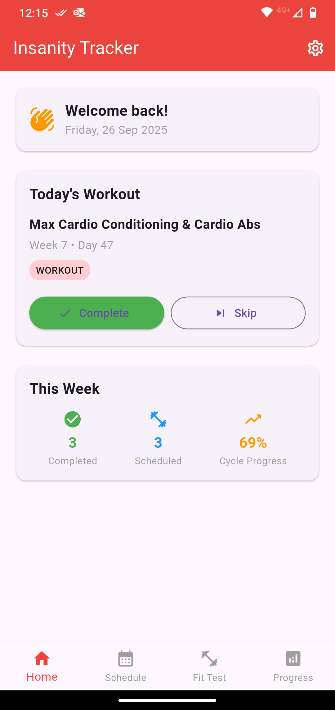
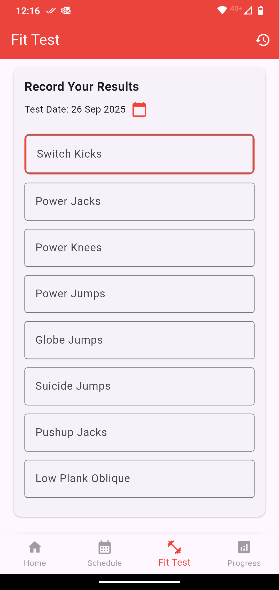
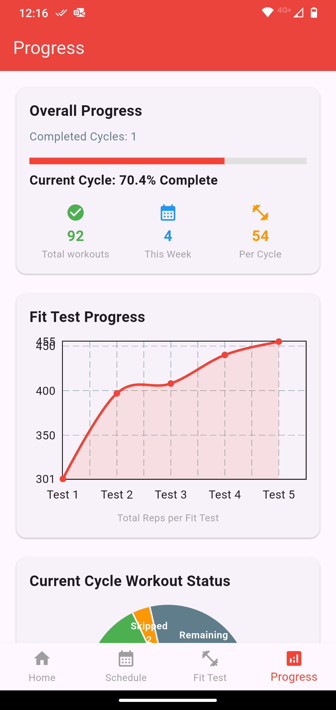

# Insanity Tracker

**Companion app for the Insanity Workout program!**

Insanity Tracker is a Flutter-based mobile application designed to help **me** track my fitness journey progress throughout the 60-day Insanity fitness program.
That is to say, I build the app for my personal and no one else's. I'm publishing in case someone out there is looking for something similar.
It provides a clear schedule, allows users to log completed workouts, monitor their Fit Test results, and visualize their overall progress.
This app runs completely offline, ensuring your workout data stays private on your device.

**Please note:** This application is a personal project and is not affiliated with, endorsed by, or in any way officially connected with the Insanity® Workout program or Beachbody, LLC.

## Features

*   **Full Program Schedule:** Access the complete 63-day Insanity workout calendar, including recovery week.
*   **Workout Tracking:** Easily mark workouts as completed, skipped, or pending for each day.
*   **Fit Test Logging:** Record your results for each of the 8 Fit Test exercises.
*   **Progress Visualization:**
    *   View your Fit Test improvements over time with clear line charts.
    *   See your workout completion statistics (completed, skipped, remaining) for the current cycle with a pie chart.
    *   Track overall program completion percentage.
    *   Monitor your current workout streak.
*   **Offline First:** All data is stored locally on your device. No internet connection is required after installation.
*   **Customizable Start Date:** Set your program's start date (must be a Monday because that's how the Insanity Schedule works). The app automatically adjusts the schedule and can auto-populate past workouts if desired.
*   **Data Management:**
    *   Option to reset program start date and clear all logged data.
    *   Import/Export: Ability to backup and restore your workout data (via the .db file).

## Screenshots

## Getting Started

This project is a Flutter application. To get a local copy up and running, follow these steps:

**Prerequisites:**

*   [Flutter SDK](https://docs.flutter.dev/get-started/install) (ensure it's added to your PATH)
*   A code editor like VS Code or Android Studio (with Flutter plugins)
*   An Android Emulator/Device or iOS Simulator/Device

**Installation & Setup:**

1.  **Clone the repository:**
2.  **Install dependencies:**
3.  **Build the APK and copy it to your phone.** ~/Android/Sdk/emulator/emulator -avd Pixel_9 -no-snapshot &
4.  **Enable installing apps from unknown sources and install the app**

## Technology Stack

*   **Framework:** Flutter
*   **Language:** Dart
*   **State Management:** Provider
*   **Local Database:** SQLite
*   **Charts:** fl_chart
*   **Shared Preferences:** For storing theme preferences and program start date.
*   **Linting:** flutter_lints
